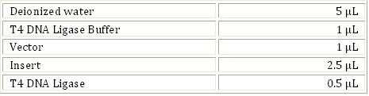

### Materials Required:-
 

Vials and Vial stand

Micro pipette

pipette  tips

Table top mini centrifuge

Beaker

Ice box
 

### Reagents:-
 

 

### Procedure:-
 

1. Take one clean fresh microfuge tube(Sample) from the rack.

2. In this microfuge tube(Vial), add 5µL water, 1µL Vector, 2.5µL insert and 1µL T4 DNA ligase buffer.

3. 0.5 µL of T4 DNA Ligase enzyme was added to the sample tube ( total reaction volume is 10 µl).

4. The vial is kept in the micro centrifuge and just spin for a few seconds.

5. Incubate the vial at room temperature (22C ) for 2 hours.

6. After 2 hours, the ligated mixture is taken for doing transformation.
   
 
### REAL LAB VERSUS VIRTUAL LAB:
 

1.    T4 DNA Ligase Buffer contains ATP, so repeated freeze thaw cycles can degrade ATP, thereby decreasing the efficiency of Ligation.

2.    It is better to vortex or spin  the T4 DNA ligase enzyme before pipetting  to ensure that it is mixed well.

 
