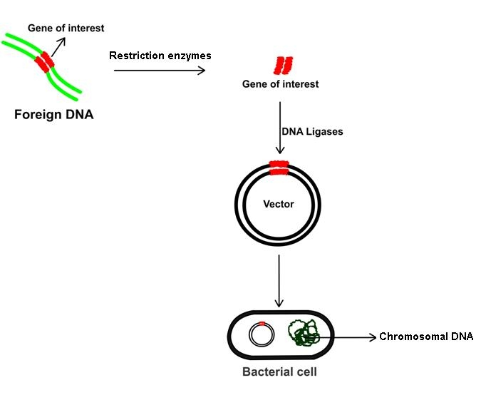
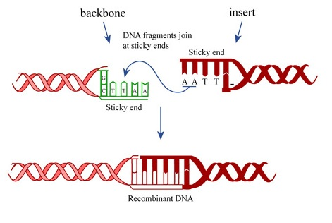
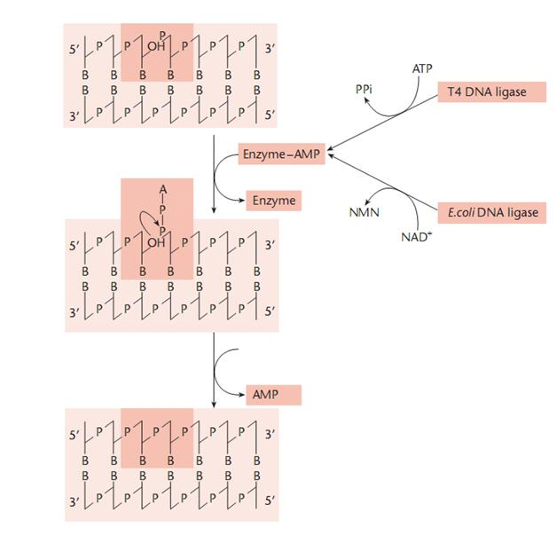
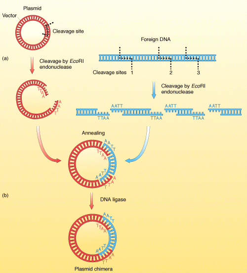
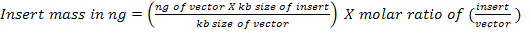

###  Theory
 

Genetic engineering is a modern biotechnology technique which is used to modify the genetic makeup of an organism by adding new traits in to it and there by produce new variety of organisms. The desired trait or gene is cut from the donor gene and pasted to the carrying vector. Thus formed recombinant DNA is transferred into the host organism which has to be modified genetically. The process of Genetic engineering is made effective by the action of two enzymes namely, Restriction enzymes and ligases. Restriction enzymes, called molecular scissors are precisely cut the desired DNA and its carrying vector, at specific sites , whereas the ligase enzyme, called Molecular glue are pasted these DNA fragments into the carrying vector. The process of ligase enzyme for joining the two ends of DNA strands is called ligation. In this process, there occurs a synthesis of phosphodiester bond between the 3'hydroxyl of one nucleotide and 5'phosphate of another.  In this situation we need to discuss about DNA and its structure.

### Structure of DNA:

DNA is made up of nucleotides which are composed of a nitrogenous base, sugar (ribose) and phosphate group. The structure thus formed is called as Double helix. The sugar and the phosphate group form the backbone of this helix. The sugar is attached to one of the four bases namely adenine, thymine, guanine and cytosine. The sugar is a pentose sugar called as the 2-deoxyribose. This sugar is connected to the carbon atoms of the adjacent sugars by phosphate groups that make the phosphodiester bonds between the third carbon atoms of one sugar to the fifth carbon atom of the adjacent sugar.

 

Ligating an insert DNA into a plasmid requires complementary ends between the DNA and the plasmid vector.  Sticky ends are produced by cutting the DNA in a staggered manner within the recognition site and there by produce short Single stranded DNA. These ends have identical nucleotide sequence and are sticky because they can bind to complementary tails of other DNA fragments cut by the same restriction enzyme. Both are useful in molecular genetics for making recombinant DNA and proteins. Blunt ends are generated by cutting both DNA strands in the middle of the recognition sequence. DNA ligase helps to join together the complementary ends of insert DNA and plasmid DNA.

 
Different parameters affect ligations such as the ratio of insert to vector, the quality and type of the DNA ends, the ligation temperature and the DNA concentration. Each of these factors is necessary for a successful ligation.  

The basic purpose in molecular cloning is the insertion of DNA fragment of interest (a segment of DNA) into a DNA molecule (called a vector) that has the capacity to replicate independantly with in a host cell. The result is a recombinant molecule composed of the DNA insert joined to vector DNA sequences. Construction of these recombinant DNA molecules is dependent on the ability to covalently seal single stranded nicks in DNA. This process is accomplished both in vivo and in vitro by the enzyme DNA ligase. 

The DNA fragments used to produce recombinant molecules are commonly generated by digestion with restriction endonucleases. Most of these enzymes cut their recognition sequences at staggered sites, giving overhanging or cohesive single-stranded tails. These are associate with each other by complementary base pairing. This paired complementary ends can be established permanently by DNA ligase treatment. Thus, two different fragments of DNA prepared by digestion with the same restriction endonuclease further joined to produce a recombinant DNA molecule.

###  Principle:-
 

DNA ligation is the act of joining together DNA strands with covalent bonds with the aim of making new viable DNA or plasmids. There are currently three methods for joining DNA fragments <i> in vitro </i>. The first of these is DNA ligase that covalently joins the annealed cohesive ends produced by certain restriction enzymes. The second depends upon the ability of DNA ligase from phage T4-infected E. coli to catalyse the formation of phosphodiester bonds between sticky or blunt-ended fragments. The third utilizes the enzyme terminal deoxynucleotidyl transferase to synthesize homopolymeric 3'single-stranded tails at the ends of fragments. The most commonly used is the T4 DNA ligase method.  

 

E.coli and phage T4 encode an enzyme, DNA ligase, which seals single-stranded nicks between adjacent nucleotides in a duplex DNA chain. Although the reactions catalyzed by the enzymes of  E. coli and T4-infected E. coli are very similar, they differ in their cofactor requirements. The T4 enzyme requires ATP, while the  E. coli enzyme requires NAD+. In each case the cofactor is split and forms an enzyme-AMP complex. The complex binds to the nick, which must expose a 5' phosphate and 3' OH group, and makes a covalent bond in the phosphodiester chain.

DNA fragments with either sticky ends or blunt ends can be inserted into vector DNA with the aid of DNA ligases. During normal DNA replication, DNA ligase catalyzes the end-to-end joining (ligation) of short fragments of DNA, called Okazaki fragments. For purposes of DNA cloning, purified DNA ligase is given to covalently join the ends of a restriction fragment and vector DNA that have complementary ends. The vector DNA and restriction fragment are covalently ligated together through the 3'5' phosphodiester bonds of DNA. When termini created by a restriction endonuclease that creates cohesive ends associate, the nicks in the joints has  few base pairs apart in opposite strands. DNA ligase can then repair these nicks to form an intact duplex. 

 

## T4 DNA Ligase
 

Bacteriophage T4 DNA ligase is a single polypeptide with a M.W of 68,000 Dalton requiring ATP as energy source.  The maximal activity pH range is 7.5-8.0.  The enzyme exhibits 40% of its activity at pH 6.9 and 65% at pH 8.3.  The presence of Mg++ ion is required and the optimal concentration is 10mM. 

T4 DNA ligase has the unique ability to join sticky and blunt ended fragments. Cohesive end ligation is carried out at 12°C to 16°C to maintain a good balance between annealing of ends and activity of the enzyme. If reaction is set at higher temperatures annealing of the ends become difficult, while lower temperatures diminishes the ligase activity. All T4 DNA ligase is inactivated by heating at 65°C for 10 minutes. Beside of these  ligating complementary sticky ends, T4 ligase can ligate any two blunt DNA ends. Lack of cohesive termini makes blunt end ligation more complex and significantly slower. Since annealing of ends is not a factor, the reaction is done  at 24°C. However, 10 - 100 times more enzyme is required to achieve similar ligation efficiency as that of cohesive end ligation. The enzyme has involved in the catalysis of the joining of RNA to either a RNA or DNA strand in a duplex molecule but this will not involved in the joining of single stranded nucleic acids.

 ## Applications:-
 

Ligation of cohesive or blunt-ended DNA fragments for cloning

Sealing nicks in double-stranded DNA

Ligation of synthetic linkers to blunt-ended DNA
 

Three main components of a ligation reaction are:- 

1) Two or more fragments of DNA that have compatible ends.

2) A buffer that has 0.25-1mM ATP to provide the necessary energy for the reaction.

3) The T4 DNA ligase.

 

The two components of the DNA in the ligation reaction (vector and insert) should be equimolar and around 100g/ml. Usually, one wants to ligate an insert DNA molecule into a plasmid, ready for bacterial transformation. Typically, DNA and plasmid vector are separately cleaved to get complementary ends, then both are added to a ligation reaction to be circularised by DNA ligase. If the ratio of plasmid backbone to insert DNA is too high then excess 'empty' mono and polymeric plasmids will be generated. If the ratio is too low results in an excess of linear and circular homo- and heteropolymers.The ideal ratios for ligating insert to vector for sticky end ligations ranges between 1:1 and 3:1, where as for blunt ended ligations, the insert to vector ratio should be at least 10:1.

 

## Calculating Insert Amount:-

